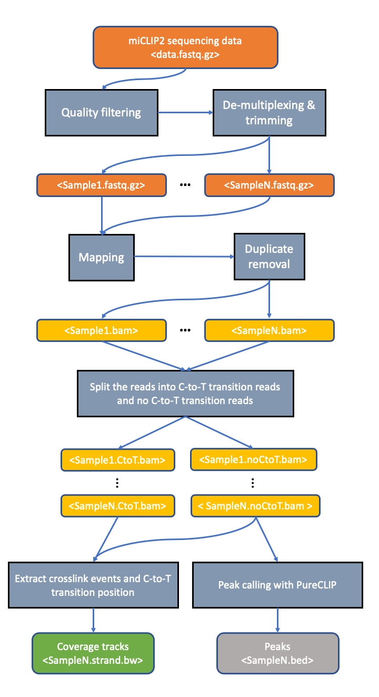
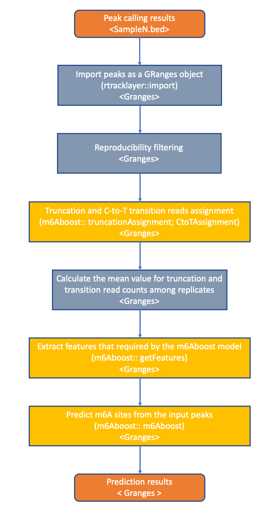

```{r style, echo=FALSE, results='asis'}
BiocStyle::markdown()
```

# Introduction

N6-methyladenosine (m6A) is the most abundant internal modification in mRNA. 
It impacts many different aspects of an mRNA's life, e.g. nuclear export, 
translation, stability, etc.   

m6A individual-nucleotide resolution UV crosslinking and immunoprecipitation 
(miCLIP) and the improved **miCLIP2** are m6A antibody-based methods that allow 
the transcriptome-wide mapping of m6A sites at a single-nucleotide resolution 
[@Koertel2020][@Linder2015]. In brief, UV crosslinking of the m6A antibody to 
the modified RNA leads to truncation of reverse transcription or C-to-T 
transitions in the case of readthrough. However, due to the limited specificity 
and high cross-reactivity of the m6A antibodies, the miCLIP data comprise a 
high background signal, which hampers the reliable identification of m6A sites 
from the data. 

For accurately detecting m6A sites, we implemented an AdaBoost-based machine 
learning model (**m6Aboost**) for classifying the miCLIP2 peaks into m6A sites 
and background signals [@Koertel2020]. The model was trained on high-confidence 
m6A sites that were obtained by comparing wildtype and _Mettl3_ knockout mouse 
embryonic stem cells (mESC) lacking the major methyltransferase Mettl3. For 
classification, the m6Aboost model uses a series of features, including the 
experimental miCLIP2 signal (truncation events and C-to-T transitions) as well 
as the transcript region (5'UTR, CDS, 3'UTR) and the nucleotide sequence in a 
21-nt window around the miCLIP2 peak.

The package `r Biocpkg("m6Aboost")` includes the trained model and the 
functionalities to prepare the data, extract the required features and predict 
the m6A sites.

# Installation

The `r Biocpkg("m6Aboost")` package is available at
[https://bioconductor.org](https://bioconductor.org) and can be
installed via `BiocManager::install`:

```{r BiocManager, eval=FALSE}
if (!require("BiocManager"))
    install.packages("BiocManager")
BiocManager::install("m6Aboost")
```

A package only needs to be installed once. Load the package into an
R session with

```{r initialize, results="hide", warning=FALSE, message=FALSE}
library(m6Aboost)
```

# Pre-requisite

The workflow described herein is based on our published paper [@Koertel2020]. 
Thus we expect the user to preprocess the miCLIP2 data based on the 
preprocessing pipeline in our article [@Koertel2020]. In brief, the 
preprocessing steps include basic processing of the sequencing reads, such as 
quality filtering, barcode handling, mapping, generation of the single 
nucleotide crosslink and the C to T transition bigWig file. After the 
preprocessing, we expect the user to do the peak calling with the tool 
[PureCLIP](https://github.com/skrakau/PureCLIP) [@Krakau2017].



**Note:** If you use `m6Aboost` in published research, please cite:

> Körtel, Nadine#, Cornelia Rückle#, You Zhou#, Anke Busch, Peter Hoch-Kraft, 
FX Reymond Sutandy, Jacob Haase, et al. 2021. “Deep and accurate detection 
of m6A RNA modifications using miCLIP2 and m6Aboost machine learning.” 
bioRxiv. https://doi.org/10.1101/2020.12.20.423675.

# The m6Aboost workflow



# Reproducibility filtering

In order to increase the reproducibility of the prediction result, we suggest 
the user to keep the peaks which present in at least two replicates for the 
following analysis.

# Loading the test data set

The package includes a test data set which allows to test all the functions 
in the m6Aboost package. The test data set comprises a subset of the
miCLIP2 peak calling result from wildtype mESC cells [@Koertel2020], 
including 1,200 peaks (PureCLIP) in three different genes 
(ENSMUSG00000026478.14, ENSMUSG00000031960.14, ENSMUSG00000035569.17). These 
are encoded in a `GRanges` object with the following metadata:    

* The column `Reads_mean` contains the *mean value* of 
truncation events at a given peak in three replicate experiments.    
* The column `CtoT` contains the *mean value* of C-to-T transitions that are
associcated with a given peak. (Note that the C-to-T transitions at an m6A site
do occur on the C flanking the modified A in the DRACH motif.)    

In addition, the package includes the annotation file `test_gff3` which
is a subset of the full annotation in `gff3` format downloaded from 
[GENCODE](https://www.gencodegenes.org/). The test truncation and C-to-T 
transition bigWig files are a subset of the miCLIP2 signal from a wildtype 
mESC cells [@Koertel2020].

```{r echo=TRUE, warning=FALSE, message=FALSE}
library(m6Aboost)
## Load the test data
testpath <- system.file("extdata", package = "m6Aboost")
test_gff3 <- file.path(testpath, "test_annotation.gff3")
test <- readRDS(file.path(testpath, "test.rds"))

test
```

# Read count assignment

After peak calling, the user needs to assign the number of truncation events 
and C-to-T transitions that are associated with each peak. In 
`r Biocpkg("m6Aboost")`, we provide two functions, `truncationAssignment` and 
`CtoTAssignment`, to assign these counts from the imported bigWig files. Note 
that the values are first assigned separated for each replicate and then 
averaged into a mean count for the subsequent feature extraction by 
`preparingData`.

```{r eval=TRUE, include=TRUE}
## truncationAssignment allows to assign the number of truncation events
## The input should be a GRanges object with the peaks and bigWig files
## with the truncation events (separated per strand)
truncationBw_p <- file.path(testpath, "truncation_positive.bw")
truncationBw_n <- file.path(testpath, "truncation_negative.bw")

test <- truncationAssignment(test, 
    bw_positive=truncationBw_p,
    bw_negative=truncationBw_n,
    sampleName = "WT1")

## CtoTAssignment allows to assign the number of C-to-T transitions
ctotBw_p <- file.path(testpath, "C2T_positive.bw")
ctotBw_n <- file.path(testpath, "C2T_negative.bw")
test <- CtoTAssignment(test, 
    bw_positive=ctotBw_p,
    bw_negative=ctotBw_n,
    sampleName = "CtoT_WT1")
```

Next, the user needs to calculate the *mean number* of truncation events and 
C-to-T transition read counts across the replicates.

```{r eval=FALSE, include=TRUE}
## E.g. for two replicates, this can be calculated as 
peak$WTmean <- (peak$WT1 + peak$WT2)/2
```

# Extract features for the m6Aboost model

For training the m6Aboost model, we used the surrounding nucleotide sequence,
the transcript region harbouring the peak, the number of C-to-T transitions and
the relative signal strength. The function `preparingData` allows to extract
these features. Please note the function `preparingData` requires
an annotation file that was downloaded from 
[GENCODE](https://www.gencodegenes.org/).

```{r}
## Extract the features for the m6Aboost prediction
test <- preparingData(test, test_gff3, colname_reads="WTmean", 
    colname_C2T="CtoTmean")
test
```

# Prediction of m6A sites

The function `m6Aboost` performs the prediction, i.e. the classification of the 
miCLIP2 peaks into m6A sites and background. As input, the function `m6Aboost` 
uses the output object from the function `preparingData`. In addition, the user 
needs to specify the name of the `BSgenome` package associated with the species 
used for the experiment. Please note that the `BSgenome` package, which 
contains the sequence information, should be downloaded from `Bioconductor` in 
advance.

## Normalization of  numerical features

Application of the machine learning model to new data set requires that the 
data were generated by the same protocol and thus show an independent and 
identical distribution. The m6Aboost model includes two numerical features from 
the miCLIP2 data, namely relative signal strength and C-to-T transitions, which 
could systematically vary between experiments. Since in the training set, both 
features approximated a *Poisson distribution*. We recommend the user to 
normalized the values of each features in the input samples by the ratio of 
the mean for this feature between the input dataset and the training set. For 
doing this normalization, user just need to set the parameter 
`normalization = TRUE`. 

```{r warning=FALSE, message=FALSE}
## Note that since the test data set contains only a tiny fraction of the real 
## data, and a part of the test data belongs to the training set. Here for 
## preventing the unnecessary value change, we set the normalization to FALSE. 
out <- m6Aboost(test, "BSgenome.Mmusculus.UCSC.mm10", normalization = FALSE)
out
```

The function `m6Aboost` returns a GRanges object with two additional metadata 
columns:    

* The column *class* provides the classification result, i.e. whether the 
m6Aboost model predicts this site to be an m6A site or not.     
* The column *prob* includes the prediction score for a given site.    

All sites with a prediction score > 0.5 are considered as m6A sites, although a 
more stringent cutoff can be applied if needed.

## Access the machine learning model m6Aboost

The raw model **m6Aboost** is stored in `r Biocpkg("ExperimentHub")`. Users 
can access the raw model with the following code:

```{r echo=TRUE, message=FALSE}
## firstly user need to load the ExperimentHub
library(ExperimentHub)
eh <- ExperimentHub()
## "EH6021" is the retrieve record of the m6Aboost
model <-  eh[["EH6021"]]
## here shows more information about the stored model
query(eh, "m6Aboost")
```

# Session info

```{r sessionInfo}
sessionInfo()
```

# References

